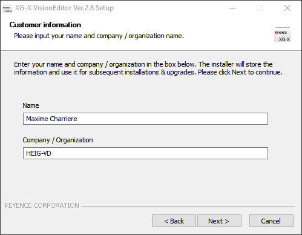

# Keyence installation

## Prerequisites

You need an Ethernet port on your computer.

## Hardware

Make sure the following elements are connected/present.    

1. 24V power supply for the controller
2. 24V power supply for the light
3. SD card is present in slot 1
4. Camera is connected to slot 1
5. Light is connected to slot 1
6. Ethernet is connected to your computer

## Software Installation

1. Start the VisionEditor installation with the following installer :  
`\\eistore1\iai-enseignement\VIN\XG-X_VisionEditor_2_8_0000.exe`
1. Enter your name  

1. Select all options  

1. When asked, install the USB driver  

1. Launch `XG-X VisionEditor Ver.2.8`
1. Copy your User ID and send it by email to your best assistant  

## Configuration
> TODO
