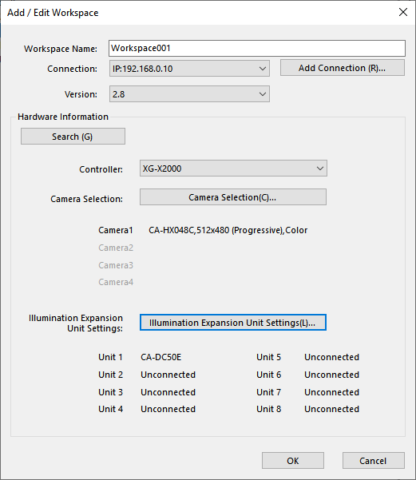
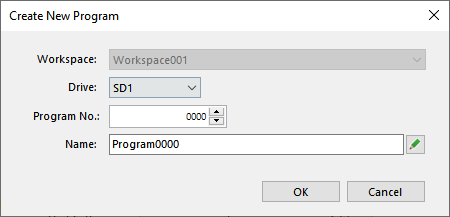

# Keyence installation

## 1. Prerequisites

You need an Ethernet port on your computer.

## 2. Hardware

Make sure the following elements are connected/present.    

1. 24V power supply for the controller
2. 24V power supply for the light
3. SD card is present in slot 1
4. Camera is connected to slot 1
5. Light is connected to slot 1
6. Ethernet is connected to your computer

## 3. Software Installation

### 3.1 VisionEditor

1. Start the VisionEditor installation with the following installer :  
`\\eistore1\iai-enseignement\VIN\XG-X_VisionEditor_2_8_0000.exe`
1. Enter your name  

1. Select all options  

1. When asked, install the USB driver  

1. Launch `XG-X VisionEditor Ver.2.8`
1. Copy your User ID and send it by email to your best assistant  

1. We will give you your activation code at the next session. You can close the window. 

### 3.2 VisionTerminal

1. Start the VisionTerminal installation with the following installer :  
`\\eistore1\iai-enseignement\VIN\XG-X_VisionTerminal_2_8_0000.exe`
1. Enter your name  

## 4. Configuration

### 4.1 Activate the program

1. Launch `XG-X VisionEditor Ver.2.8`  
1. Enter the activation code that was provided to you  
1. Exit XG-X VisionEditor  

### 4.2 Set a static IP

1. Search for `Network Connections` in the Windows search bar
1. Right-clic on your physical Ethernet port &rarr; Properties &rarr; Protocole Internet version 4 
1. Enter this parameters:
    - IP adress: `192.168.0.1`  
    - Subnet mask: `255.255.255.0 `  

### 4.3 Connect to the controller

1. In VisionEditor, go in the `File` tab
1. In the `Conections & Controllers` section, clic on `Add`
1. Specify the IP adress `192.168.0.10`  

## 5. Create a workspace and program
1. In VisionEditor, go in the `File` tab
1. Clic on Create New Workspace  
1. If the controller is connected, you can directly get informations about the connected camera and light, so you don't have to change it later  

1. Chose a program name, an unique Program No., and save it on drive SD1  

## 6. Troubleshooting

### 6.1 Change User Account

You may not have full privileges on the controller. For example you cannot go into `Setup mode`. To change this, you need to change the User Account configuration. 
1. In VisionEditor, go in the `Program Setting` tab
1. Other Settings &rarr; Account Settings
1. Set the default account to `Administrator`
1. Upload changes to the controller

